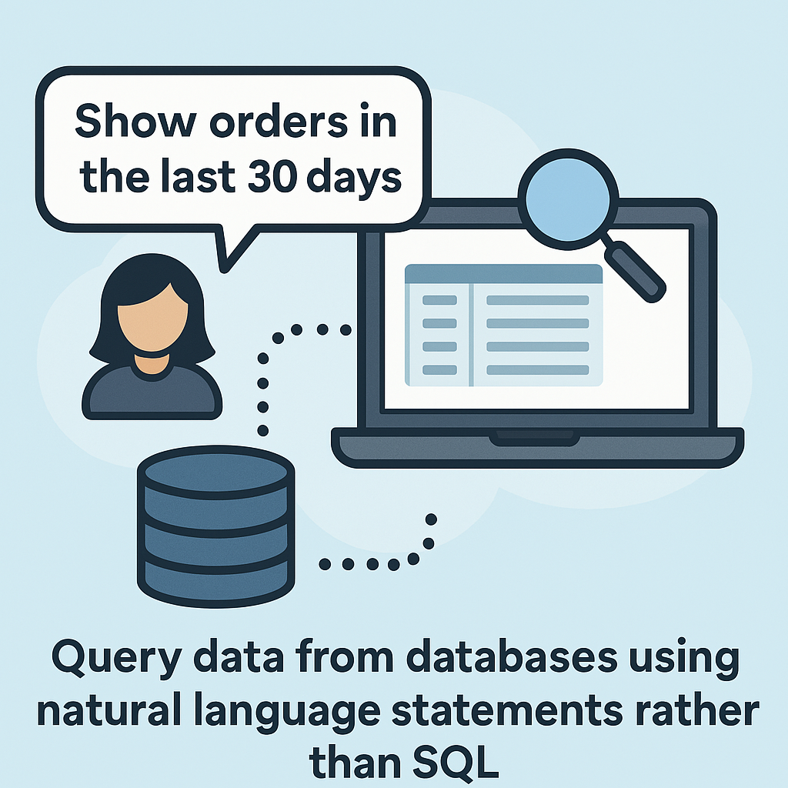

# AIQuery - Database Querying Solution



A Flask-based web application that allows querying multiple database types (PostgreSQL, MySQL, Oracle) with natural language processing capabilities.

## Features

- Multi-database support (PostgreSQL, MySQL, Oracle) [Tested only for Postgres at the moment. Others on the way !]
- Natural language to SQL conversion
- User authentication and authorization
- Admin dashboard features:
  * User management
  * Detailed audit logging with:
    - Action tracking (queries, logins, admin actions)
    - Time-based filtering
    - User activity monitoring
- Dockerized development environment

## Database Configuration

- **Development**: SQLite database (`app.db`) for easy local testing
- **Production**: PostgreSQL in Docker for:
  * Better performance
  * Concurrent connections
  * Data persistence
  * Scaling capabilities

## Tech Stack

- **Backend**: Python, Flask
- **Frontend**: HTML, CSS, JavaScript, Jinja2
- **Database**: PostgreSQL (primary), SQLAlchemy ORM
- **AI Integration**: OpenRouter API for NL-to-SQL
- **Containerization**: Docker, Docker Compose

## Getting Started

### Prerequisites

- Docker
- Docker Compose
- Python 3.10+

### Installation

1. Clone the repository:
```bash
git clone https://github.com/yourusername/aiquery.git
cd aiquery
```

2. Create a `.env` file (use `.env.example` as template):
```bash
cp .env.example .env
```
   **Important:** Edit the `.env` file and set the required variables, especially `FERNET_KEY` (see Configuration section below).

3. Build and start the containers:
```bash
make init
make up
```

4. Access the application at: http://localhost:5001

## Usage

### Common Commands

- Start services: `make up`
- Stop services: `make down`
- Run tests: `make test`
- Create database migration: `make migrate`
- Open shell: `make shell`
- View logs: `make logs`

## Configuration

Edit the `.env` file for environment-specific settings:

- `FLASK_DEBUG`: Set to `1` for development (enables debugger and reloader), **set to `0` for production**. Running with debug enabled in production is a major security risk.
- `DATABASE_URL`: Database connection string
- `SECRET_KEY`: **Required**. Flask secret key for session security. Change the default placeholder to a long, random string.
- `OPENROUTER_API_KEY`: API key for OpenRouter service
- `ADMIN_EMAIL`: Initial admin user email
- `FERNET_KEY`: **Required** for encrypting database connector passwords. Generate a key using the command:
  ```bash
  python -c "from cryptography.fernet import Fernet; print(Fernet.generate_key().decode())"
  ```
  Copy the generated key and paste it as the value for `FERNET_KEY` in your `.env` file. Keep this key secret!

## Project Structure

```
aiquery/
├── app/                  # Application code
│   ├── auth/             # Authentication blueprints
│   ├── connectors/       # Database connector management
│   ├── templates/        # Jinja2 templates
│   ├── static/           # Static files (CSS, JS)
│   └── __init__.py       # Application factory
├── tests/                # Test cases
├── Dockerfile            # Docker configuration
├── docker-compose.yml    # Service orchestration
├── Makefile              # Development commands
└── requirements.txt      # Python dependencies
```

## Testing

For detailed testing documentation including how to run tests and coverage reports, see [TESTING.md](TESTING.md).

## License

MIT License - see [LICENSE](LICENSE) for details.

## Contributing

1. Fork the project
2. Create your feature branch
3. Commit your changes
4. Push to the branch
5. Open a pull request
